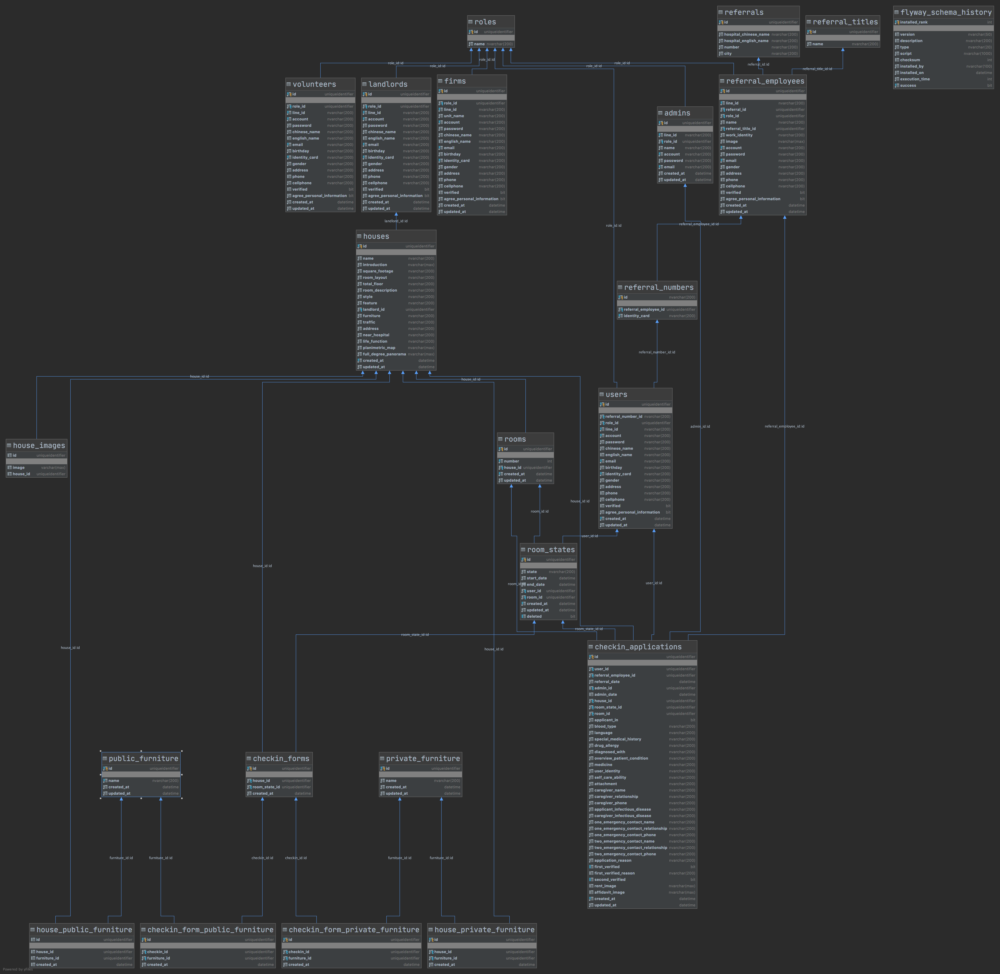

# Love-Station-API

https://jackfrisht.medium.com/install-nvidia-driver-via-ppa-in-ubuntu-18-04-fc9a8c4658b9

## Requirements
+ Java 1.11
+ SQL Server 2019
+ Docker
+ Docker-Compose

## Development

### Local

```bash
sh ./dockerbuild.sh local
```
+ 自動啟動SQL Server and Redis Container

### Development(測試環境)

```bash
sh ./dockerbuild.sh dev
```

+ 自動啟動SQL Server and Redis container
+ maven 打包 jar 並且啟動love-station-api container
+ Domain: https://api.loveeden.tk

### Production(上線環境)

```bash
sh ./dockerbuild.sh prod
```
+ 自動啟動Redis container and 連線到remote SQL Server
+ maven 打包 jar 並且啟動love-station-api container
+ Domain: https://ehome.eden.org.tw
#### SSH
+ 外部連線IP：211.21.104.227
##### Application Server
+ CentOS 8
+ 內部連線IP：192.168.127.215
+ SSH Port：222
+ 帳號：root
+ 密碼：edenehome
##### MS-SQL 2019
+ 內部連線IP：192.168.127.210
+ SSMS Port：14333
+ MSSQL帳號：sa
+ MSSQL密碼：qweR5678

### SSL 設定
+ https://www.digitalocean.com/community/tutorials/how-to-secure-nginx-with-let-s-encrypt-on-ubuntu-20-04
+ 裝完nginx以後，nginx.conf加入域名對應到的本地port
```
##
# Basic Settings
###

server {
  server_name www.example.com;
  location / {
    proxy_pass http://127.0.0.1:3000;
    client_max_body_size 100m;
  }
}
```

### Note

+ 如果有改程式碼，重複執行指令即可，會自動重新build新版本的image and restart container
+ 重新運行的話**dev** and **local**的SQLServer資料會消失 可依照需求自行添加Volume或是自己在本機上架SQL Server(~~建議不要 垃圾資料庫~~)

## Project Structure

```
.
├── README.md
├── docker-compose-dev.yaml
├── docker-compose-prod.yaml
├── Dockerfile-dev
├── Dockerfile-prod
├── dockerbuild.sh
├── love-station.iml
├── mvnw
├── mvnw.cmd
├── pom.xml
├── storage
│   ├── checkin-application-affidavit
│		每個user入住切結書
│   ├── checkin-application-rent
│		每個user入住契約書
│   ├── house-full-degree-panorama
│		每個house 360度圖
│   ├── house-panimetric-map
│		每個house 平面圖
│   ├── referral-employee-images
│		每個轉介人員個人照
├── src
│   ├── main
│   │   ├── java
│   │   │   └── org
│   │   │       └── eden
│   │   │           └── lovestation
│   │   │               ├── config
│   │   │               │   管理所有java bean config
│   │   │               ├── controller
│   │   │               │   管理所有API輸入輸出
│   │   │               ├── dao
│   │   │               │   ├── model
│   │   │               │   │   對應於database table
│   │   │               │   └── repository
│   │   │               │       jpa操作層
│   │   │               ├── dto
│   │   │               │   ├── enums
│   │   │               │   │   enum封裝
│   │   │               │   ├── projections
│   │   │               │   │   jpa projection封裝
│   │   │               │   ├── request
│   │   │               │   │   request dto封裝
│   │   │               │   └── response
│   │   │               │       response dto封裝
│   │   │               ├── exception 
│   │   │               │   exception統一處理
│   │   │               │   └── business
│   │   │               │       用來定義所有business exception
│   │   │               ├── security
│   │   │               │   spring security設定
│   │   │               ├── service
│   │   │               │   define business logic
│   │   │               │   └── impl
│   │   │               │       implement business logic
│   │   │               └── util
│   │   │                   常用工具封裝
│   │   │               │   ├── checker
│   │   │               │   │   check mapping object using modelmapper
│   │   │               │   ├── email
│   │   │               │   │   send email
│   │   │               │   ├── jwt
│   │   │               │   │   jwt token verify封裝
│   │   │               │   └── line
│   │   │               │       send line push message 封裝
│   │   │               │   └── password
│   │   │               │       generate hash password
│   │   │               │   └── storage
│   │   │               │       store file
│   │   │               │   └── validator
│   │   │               │       request data validate
│   │   └── resources
│   │       ├── application.properties
│   │       └── db
│   │           └── migration
│   │               database migration SQL file
│   │				└── common
│   │               for table and index create
│   │				└── dev
│   │               insert dev testing data
│   │			    └── prod
│   │               insert prod testing data
│   │       └── static
│   │           static file for user download
│   └── test (too less money, i don't want to write it!)
│       └── java
│           └── org
│               └── eden
│                   └── lovestation
│                       └── LoveStationApplicationTests.java
```

## API Document

https://edenapi.docs.apiary.io

+ 如果線上修改文檔記得要**手動存擋**
+ 線上多人修改會有Race Condition問題，建議使用Git來做版本管理：https://github.com/Eden-Case/Love-Station-API-Document
+ 每個人更新文檔前請先開新的branch，經過review後再merge到main上，線上的版本會自動follow main branch

### 自行架設API Document Server
+ 請參考:https://github.com/danielgtaylor/aglio
+ 想轉成Swagger?請參考:https://github.com/kminami/apib2swagger

## Database Schema



## System Design

### Role

共有六種角色

+ User(就醫民眾)
+ ReferralEmployee(轉介人員)
+ Landlord(房東)
+ Volunteer(志工)
+ Firm(廠商)
+ Admin(業管單位---就是伊甸本身拉)

透過定義角色名稱來給予使用者不同的權限

### User

+ 需要先跟轉介單位人員申請轉介編號與身分證的綁定才能註冊該系統
+ 登入後可以進行租房流程：
  1. 需要先私底下跟轉介人員說，由轉介人員在系統上申請入住
  2. 如果被業管單位審核過第一階段使用者需要在自己頁面上upload必要的檔案再交由業管單位繼續審核
  3. 審核都通過，快樂去住房子

### ReferralEmployee

+ 負責申請就醫民眾身分證與轉介編號的綁定
+ 負責幫就醫民眾申請入住申請
+ 其他功用就是收到一堆通知跟看到入住申請的歷史紀錄而已

### Landlord

+ 可以自行註冊系統，不須經過轉介編號等流程
+ 負責上傳他的租屋環境等資訊以及收到一堆通知

### Volunteer

+ 可以自行註冊系統，不須經過轉介編號等流程
+ 負責上傳他的租屋環境等資訊以及收到一堆通知

### Firm

+ 可以自行註冊系統，不須經過轉介編號等流程
+ 負責上傳他的租屋環境等資訊以及收到一堆通知

### Admin

+ 審核所有使用者的註冊帳號審核
+ 審核所有入住申請
+ 後台管理介面---各種搜尋歷史紀錄的filter實作
